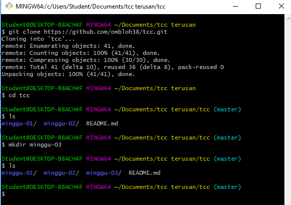
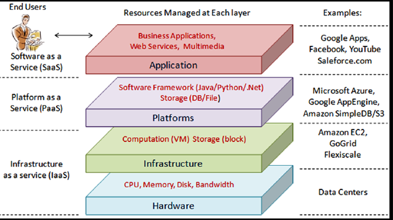

175410002

FAUZAN HADISURYO

Pertama clone github kita
kemudian membuat folder minggu-03

## SAS
Software as a service (SaaS) atau perangkat lunak berbentuk layanan adalah suatu model penyampaian aplikasi perangkat lunak oleh suatu vendor perangkat lunak yang mengembangkan aplikasi web yang diinangi dan dioperasikan (baik secara mandiri maupun melalui pihak ketiga) untuk digunakan oleh pelanggannya melalui Internet.

Software as a service (SaaS) saat ini juga merupakan salah satu komponen penting dalam pengembangan sistem-sistem diberbagai sektor bisnis yang menggunakan perangkat lunak/aplikasi untuk menjalankan kegiatannya.

## KEUNGGULAN SAS
1. Software aplikasi yang sederhana namun bermanfaat 
 
2. Efisien penggunaan lisensi software 
Pelanggan dapat memiliki lisensi tunggal untuk beberapa komputer yang berjalan di lokasi yang berbeda yang mengurangi biaya lisensi
3. Pengelolaan dan data terpusat 
 Cloud computing  menyimpan data secara terpusat. Namun, penyedia cloud dapat menyimpan data dengan cara yang terdesentralisasi demi redundansi dan reliabilitas
 4. Tanggung jawab platform dikelola oleh vendor SaaS 
 Semua tanggung jawab platform seperti backup, pemeliharaan sistem, keamanan, penyegaran perangkat keras, manajemen daya, dll dilakukan oleh penyedia cloud

## KEKURANGAN SAS
1. Rentan terkena virus internet 
Jika pelanggan mengunjungi situs web dan browser berbahaya yang terinfeksi virus, akses selanjutnya ke aplikasi SaaS mungkin akan membahayakan data pelanggan
2. Ketergantungan dengan internet 
Aplikasi SaaS hanya bisa berjalan bila jaringan internet tersedia
3. Tidak bisa berbagi beban kerja cloud 
Mentransfer beban kerja dari satu cloud SaaS ke cloud SaaS lainya tidak mudah karena alur kerja, logika bisnis, antarmuka pengguna, skrip dukungan dapat menjadi penyedia spesifik. 

## CONTOH APLIKASI SAS
1. Dropbox
2. Google Apps
3. MTARGET
4. Salesforce
5. Cisco WebEx.
6. yahoo mail

## ARSITEKTUR SAS (CLOUD COMPUTING)
arsitektur cloud terbagi menjadi 4
1. lapisan perangkat keras (hardware)
2. infrastruktur
3. platform
4. aplikasi,

erdasarkan Gambar diatas, lapisan paling bawah adalah lapisan perangkat keras. Lapisan ini bertanggung jawab dalam pengelolaan sumber daya fisik dari cloud. Lapisan ini terdiri dari perangkat fisik seperti server, router, switch, power, dan sistem pendingin. Secara fisik, lapisan ini sering dikelompokkan sebagai pusat data (data center). Lapisan selanjutnya adalah lapisan infrastruktur. 

Lapisan infrastruktur dikenal dengan lapisan virtualisasi dan bertanggung jawab untuk membentuk media yang terdiri dari media penyimpanan (storage) dan sumber daya komputasi yang terpartisi dari sumber daya fisiknya.
 
Lapisan berikutnya adalah lapisan platform. Lapisan ini terdiri dari sistem operasi dan kerangka aplikasi. Lapisan ini bertanggung jawab untuk meminimalisasi beban penyebaran aplikasi secara langsung ke dalam wadah mesin virtual. Tingkatan tertinggi dari hirarki arsitektur cloud computing adalah lapisan aplikasi. Lapisan ini terdiri dari aplikasi aktual dari cloud dimana jenis layanannya secara langsung dapat dikirimkan atau digunakan oleh pengguna akhir. Secara umum jenis delivery service yang disampaikan melalui lapisan ini disebut sebagai Software as a Service (SaaS). Bila dibandingkan dengan lingkungan layanan tradisional, seperti dedicated server farms atau server clusters, arsitektur cloud computing lebih modular. Setiap lapisan memiliki sistem loosely-coupled antara lapisan di atas dengan yang di bawah.

